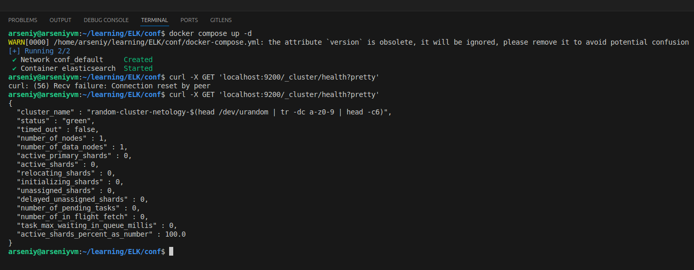
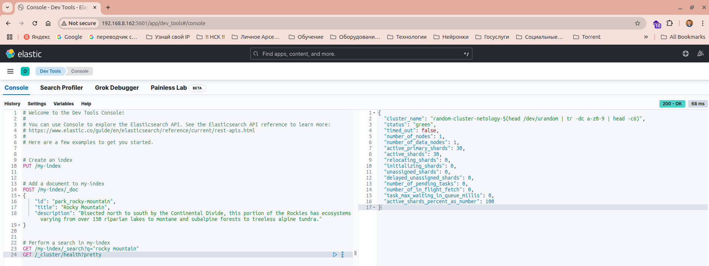
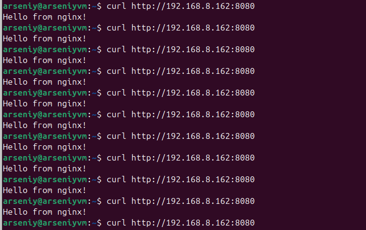
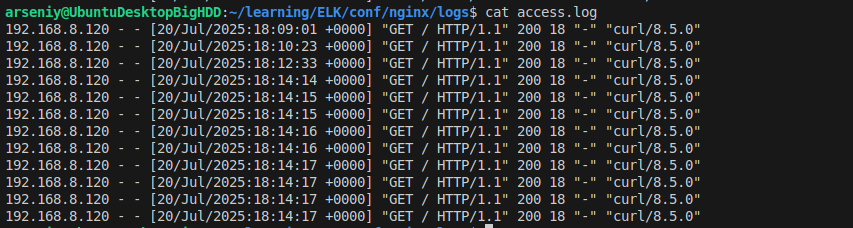
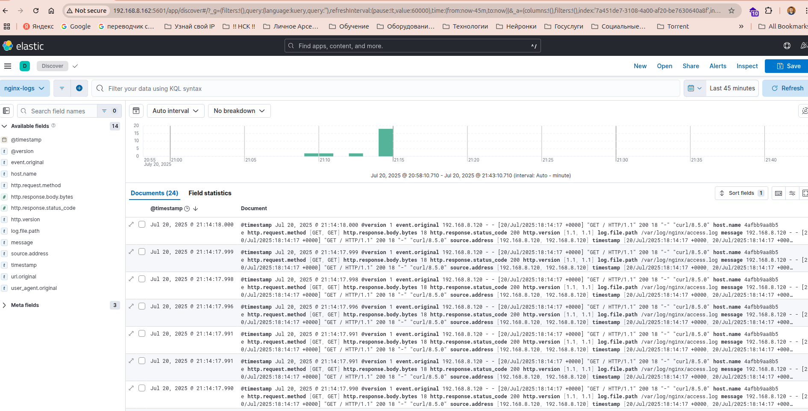
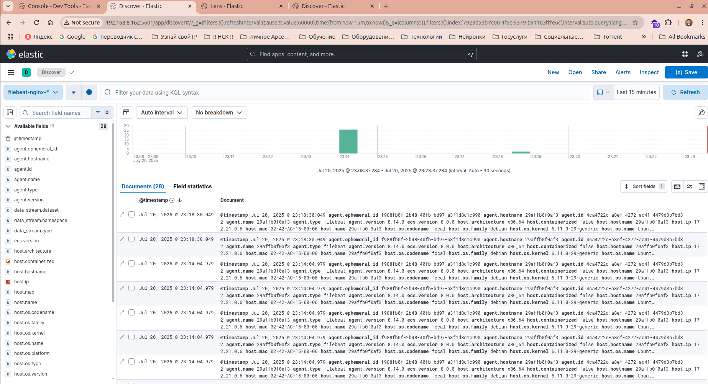

# Домашнее задание к занятию   
**"`ELK`"** - `Воскобойников Арсений Петрович`  
   
**Задание 1. Elasticsearch**  
``` 
Установите и запустите Elasticsearch, после чего поменяйте параметр cluster_name на случайный.

Приведите скриншот команды 'curl -X GET 'localhost:9200/_cluster/health?pretty', сделанной на сервере с установленным Elasticsearch. Где будет виден нестандартный cluster_name.
``` 
**Ответ**  
Отредактируем docker-compose конфиг, заменив имя сервера на random-cluster-netology  



После запуска проверим при помощи команды Curl имя сервера.

**Задание 2. Kibana**   

```
Установите и запустите Kibana.

Приведите скриншот интерфейса Kibana на странице http://<ip вашего сервера>:5601/app/dev_tools#/console, где будет выполнен запрос GET /_cluster/health?pretty.

``` 
**Ответ:**   
Добавим в Docker compose Kibana (запускал на отдельной машине).
Запрос и ответ на скриншоте. 



**Задание 3. Logstash**  

```
Установите и запустите Logstash и Nginx. С помощью Logstash отправьте access-лог Nginx в Elasticsearch.

Приведите скриншот интерфейса Kibana, на котором видны логи Nginx.

```

**Ответ:**  

Создадим конфигураци для  [Logstash](/conf/logstash/logstash.conf),  [Nginx](/conf/nginx/nginx.conf)  
Дополним конфиг [Docker Compose](/conf/docker-compose.yml)
Всё запустим.
Проверим работу Nginx. Отправим несколько запросов   
и посмотрим их наличие в логе
 

Далее в интерфейсе Kibana создадим index patern:nginx-logs и проверим, что лог отображет наши запросы.
 


**Задание 4. Filebeat.**  

```
Установите и запустите Filebeat. Переключите поставку логов Nginx с Logstash на Filebeat.

Приведите скриншот интерфейса Kibana, на котором видны логи Nginx, которые были отправлены через Filebeat.

```

**Ответ**  
Заменим в docker compose Logstash на [Filebeat](/conf/filebeat/filebeat.yml) и всё перезапустим.

 

Вижу, что все логи запросов отобразились корректно.

* файл docker compose приведён сразу со всеми сервисами, но для выполненияч домашнего задания запускал их по очереди и в зависимости от задания.

